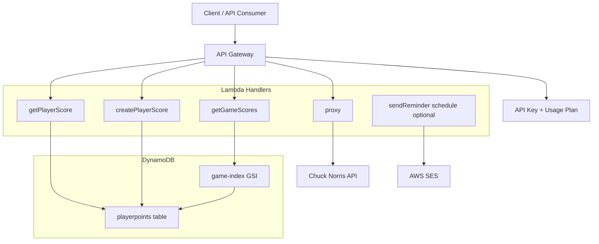

# serverless-lambda

## What does this project do, and why was it built?

This project is a Serverless Framework service that exposes an API for storing and reading player scores from DynamoDB.

It was built to demonstrate a practical AWS serverless setup with:
- API Gateway + Lambda handlers for CRUD-style endpoints
- DynamoDB persistence with a `game-index` GSI for game-based lookups
- API key usage plans (`free` and `paid`) to control access and rate limits
- A local development workflow using `serverless-offline`

In short, this is a compact learning/template project for building event-driven APIs without managing servers.

## What does the architecture look like?



### Request flow by endpoint

- `GET /player-score/{ID}` -> reads one player record from DynamoDB
- `POST /player-score/{ID}` -> writes/overwrites a player record in DynamoDB
- `GET /game-scores/{game}` -> queries DynamoDB by `game-index`
- `ANY /flourish/{proxy+}` -> API Gateway HTTP proxy integration to `https://api.chucknorris.io/{proxy}`

Notes:
- `getPlayerScore` and `createPlayerScore` are marked `private: true`, so they require an API key.
- Scheduled reminder email Lambda exists in code, but event wiring is currently commented out in `yml/functions.yml`.

## How do I run this locally, and how do I deploy it?

## Prerequisites

- Node.js 18+
- npm
- Serverless Framework v3 (`npx serverless` is fine)
- AWS credentials configured locally (for deployment and real AWS services)

## Local run

1. Install dependencies:

```bash
npm install
```

2. Start offline API (configured on port `5000`):

```bash
npx serverless offline
```

3. Example local calls:

```bash
curl "http://localhost:5000/dev/game-scores/fifa"
curl -X POST "http://localhost:5000/dev/player-score/123" -H "Content-Type: application/json" -d "{\"name\":\"Ali\",\"game\":\"fifa\",\"points\":100}"
curl "http://localhost:5000/dev/player-score/123"
```

If you test endpoints marked private, include an API key header when needed:

```bash
-H "x-api-key: <your-api-key>"
```

## Deploy

Deploy to AWS (default `dev` stage, `us-east-1`):

```bash
npx serverless deploy
```

Deploy a specific stage:

```bash
npx serverless deploy --stage prod
```

Remove stack:

```bash
npx serverless remove --stage dev
```

## What decisions were made, and why?

- **Serverless Framework + AWS Lambda**: chosen to keep infrastructure minimal and focus on function logic.
- **DynamoDB `PAY_PER_REQUEST`**: avoids capacity planning and is cost-friendly for variable traffic.
- **Single table (`playerpoints`) + GSI (`game-index`)**: supports direct `ID` reads and efficient game-level queries.
- **Shared response and Dynamo utility modules**: keeps handlers concise and consistent.
- **API key tiers (`free`/`paid`)**: demonstrates simple product gating and rate limiting from API Gateway usage plans.
- **HTTP proxy endpoint**: shows how to pass through external APIs without custom Lambda transformation logic.

## What would be improved next?

- Add automated tests (unit + integration with local DynamoDB) and CI checks.
- Add input validation (e.g., JSON schema) and stricter error handling with consistent error codes.
- Add observability (structured logging, metrics, alarms, tracing).
- Harden security: least-privilege IAM policies, secrets management, and stage-specific config.
- Add documentation for retrieving/rotating API keys and clearer environment setup for new contributors.
- Re-enable and productionize scheduled reminder email flow with configurable recipients and templates.

## Glossary
**GSI**: A Global Secondary Index(GSI) in DynamoDB is an index that allows you to query the data using attributes other than the primary key in the table.